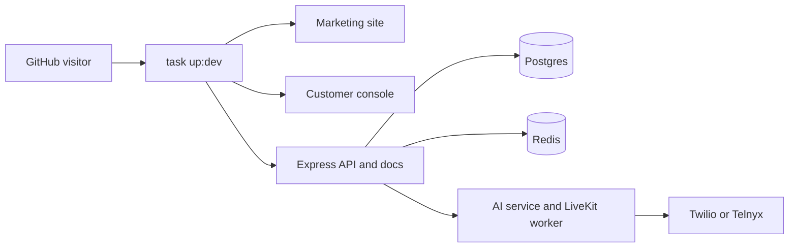

# QuickVoice

**Open-source AI phone-agent infrastructure you can run, inspect, and extend.**

QuickVoice is the open-source Retell alternative for engineering-led teams that want control over the voice-agent stack instead of only consuming a closed hosted API. It gives teams the full product surface in one repo: a marketing site, customer console, API server, LiveKit-powered AI worker, telephony integrations, knowledge bases, call logs, outbound campaigns, billing paths, MCP/tool connections, privacy controls, and local development tooling.

Website: [quickvoice.co](https://quickvoice.co)

[](https://github.com/allgpt-co/QuickVoice/stargazers)

<p align="center">
  
</p>

## 30-Second Tour

- **What it does:** build AI agents that answer inbound calls, place outbound calls, use uploaded knowledge, and record operational outcomes.
- **Why it exists:** keep the voice-agent stack inspectable instead of outsourcing every runtime, data, cost, and telephony decision to a closed platform.
- **What you can run locally:** the web app, console, API, AI service, Postgres, Redis, Prisma migrations, and generated dev env files.
- **What needs real credentials:** real phone calls require LiveKit plus Twilio or Telnyx credentials; billing, OAuth, email, and storage need their provider keys.
- **How it is positioned:** see the [core positioning framework](./docs/positioning/core-positioning-framework.md) for code-backed marketing and sales claims.



## Quick Start

If your machine already has Docker, Docker Compose, Go Task, Node.js `>=18`, and Python 3, the local path is one command:

```sh
task up:dev
```

`task up` and `task dev` are aliases. Go Task treats spaces as separate task names, so prefer `task up:dev` for the explicit form.

First things to open:

- Console: `http://localhost:3000`
- Marketing site: `http://localhost:3001`
- API health: `http://localhost:5000/api/v1/health`
- API docs: `http://localhost:5000/api/v1/docs`
- AI API health: `http://localhost:5555/health`

On a fresh Ubuntu host, install the missing host tools first:

```sh
sudo apt-get update
sudo apt-get install -y docker.io docker-compose-v2 golang-go
sudo usermod -aG docker "$USER"
go install github.com/go-task/task/v3/cmd/task@latest
export PATH="$PATH:$HOME/go/bin"
```

Reconnect the SSH session after changing Docker group membership. Then run:

```sh
task up:dev
```

The task creates local env files from `*.env.dev.example`, activates `pnpm@9.0.0`, installs Node dependencies with the frozen lockfile, creates the AI Python virtualenv, starts Postgres and Redis through `docker-compose.dev.yml`, runs Prisma migrations, and launches the local services above.

The Docker Compose database credentials are dev-only placeholders (`quickvoice` / `quickvoice`) and the Postgres and Redis ports are bound to `127.0.0.1`. Edit the generated env files after the first run if you need real Google, Stripe, LiveKit, Twilio, Telnyx, SMTP, or AWS credentials. Generated env files are ignored by git.

Optional local email testing is available through a Docker Compose profile:

```sh
docker compose -f docker-compose.dev.yml --env-file .env.dev --profile mail up -d mailpit
```

Useful individual tasks:

```sh
task doctor
task env:dev
task docker:up
task db:migrate
task db:seed -- --email you@example.com
task ci
task server:dev
task console:dev
task web:dev
task ai:api
task ai:worker
```

Common root commands:

```sh
pnpm build
pnpm lint
pnpm check-types
pnpm test
pnpm ci:local
pnpm audit:deps -- --audit-level high
```

## Why QuickVoice

Voice agents are becoming core business infrastructure. Hosted APIs are useful when speed and convenience matter most. QuickVoice is for teams that also need source-level control, self-hosting options, privacy review, cost visibility, and a path to extend the product for their own workflows.

- **Control:** run the console, API, worker, database, and telephony bindings yourself.
- **Self-hosting:** evaluate the local stack with `task up:dev`, then decide how and where to deploy.
- **Privacy:** inspect storage, logs, call metadata, recordings, transcripts, secrets, retention controls, and runtime configuration before production use.
- **Cost visibility:** bring your own LiveKit, Twilio or Telnyx, Postgres, Redis, S3-compatible storage, vector database, and model providers instead of treating every dependency as an opaque bundle.
- **Extensibility:** fork the repo, modify agents, add knowledge sources, attach MCP tools, wire new providers, or adapt permissions, billing, and campaign workflows.

## Code-Backed Differentiators

- **Per-call runtime control:** the LiveKit worker loads agent configuration by phone number or agent ID at call start, then applies outbound metadata overrides for first message, prompt, language, voice, and dynamic variables.
- **Live knowledge and tools:** agents can retrieve Pinecone-backed knowledge context during user turns and call allowlisted MCP tools through the server bridge. Side-effect tools are hidden from live-call instructions unless explicitly safe.
- **Inspectable privacy boundaries:** call-log PII redaction is enabled by default, zero-PII retention can suppress transcripts and recordings, secrets are encrypted or referenced, remote URLs are screened for private-network targets, and retention jobs clean up old transcripts, recordings, failed KB rows, and MCP logs.
- **Direct telephony ownership:** Twilio and Telnyx number purchase flows, provider binding, LiveKit trunk binding, rollback behavior, inbound routing, outbound quick calls, and batch campaigns are implemented in the repo.

## What QuickVoice Is Not

QuickVoice is not a zero-setup hosted phone-agent API from a fresh clone. Local development starts with `task up:dev`, but carrier-connected calls need LiveKit plus Twilio or Telnyx credentials, and production deployments need deliberate choices around auth, secrets, storage, retention, provider agreements, and operations.

The repository makes privacy and compliance-relevant data paths inspectable, but it is not by itself a HIPAA, SOC 2, ISO 27001, PCI, GDPR, or CCPA certification claim. Those claims depend on deployment, controls, provider agreements, audits, and legal review.

## What You Can Build

- Inbound AI receptionists and support agents
- Outbound sales, reminders, collections, and follow-up workflows
- Appointment scheduling and qualification calls
- Knowledge-backed agents that answer from uploaded sources
- Campaigns that call many contacts and track outcomes
- Voice automation for healthcare, financial services, logistics, real estate, ecommerce, and operations teams

## What's Inside

- `apps/web` - Next.js website with product pages, use cases, industry pages, blog content, pricing, and legal pages.
- `apps/console` - Next.js customer console for organizations, agents, numbers, calls, knowledge bases, API keys, billing, and settings.
- `apps/server` - Express API server with auth, permissions, agent configuration, phone numbers, call logs, outbound calls, MCP connections, retention jobs, Stripe, Twilio, Telnyx, LiveKit, S3, Redis/BullMQ, and Inngest integrations.
- `apps/ai` - Python AI service and LiveKit worker handlers for runtime configuration, RAG, MCP tool execution, privacy controls, call logging, recording, and voice-agent execution.
- `packages/eslint-config` and `packages/typescript-config` - Shared monorepo linting and TypeScript configuration.
- `scripts`, `Taskfile.yml`, and `docker-compose.dev.yml` - Local orchestration for Node services, Python services, Prisma, Postgres, and Redis.

## Stack

- Product and marketing: Next.js, React, Tailwind CSS
- API: Express, TypeScript, Better Auth
- Voice runtime: LiveKit Agents, Python workers, Silero VAD, multilingual turn detection, noise cancellation
- Telephony: Twilio and Telnyx
- AI providers: configurable commercial STT, LLM, and TTS model IDs through LiveKit inference; the default path is not local LLM deployment
- Knowledge and tools: Pinecone, Google embeddings, MCP/Smithery connections, custom HTTP tools
- Data: Postgres, Prisma, Redis/BullMQ, S3-compatible object storage
- Billing: Stripe
- Monorepo: pnpm and Turborepo

## Open Source And Commercial Use

QuickVoice is licensed under the [GNU Affero General Public License v3.0](./LICENSE).

You can use, study, modify, and distribute the code under the AGPL. If you modify QuickVoice and make it available to users over a network, the AGPL requires you to make the corresponding source code available under the same license.

For teams that need a commercial license, managed hosting, implementation support, or enterprise terms, contact QuickVoice through [quickvoice.co](https://quickvoice.co).

This section is not legal advice. Review the AGPL and consult counsel for your specific use case.

## Support The Project

If QuickVoice helps you evaluate open voice-agent infrastructure, a GitHub star is a useful public signal. It helps maintainers see where there is interest without adding prompts to the product or asking for coordinated votes.

[Star QuickVoice on GitHub](https://github.com/allgpt-co/QuickVoice)

[](https://www.star-history.com/#allgpt-co/QuickVoice&Date)

## Community

QuickVoice is built in public for teams that want programmable, inspectable phone automation.

- Open issues for bugs, gaps, and integration requests.
- Read [CONTRIBUTING.md](./CONTRIBUTING.md) before submitting a pull request.
- Report security issues through [SECURITY.md](./SECURITY.md).

## License

AGPL-3.0-only. See [LICENSE](./LICENSE).
